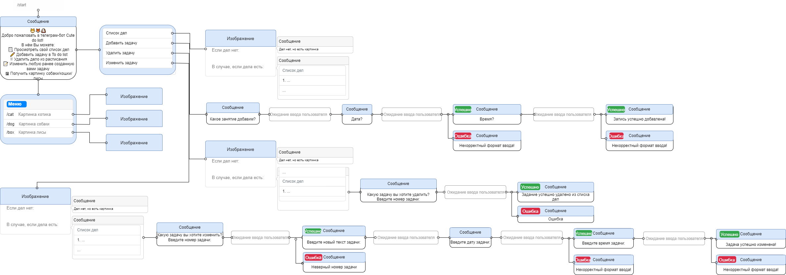

# :calendar: Telegram-bot "Cute do list"
 

 :pushpin:  Добро пожаловать в репозиторий с реализацией телеграм-бота "Cute do list"!  :pushpin: 
 

**Cute do list** -  телеграм-бот, с помощью которого пользователи могут создавать собственные списки дел с возможностью дальнейшей модификации в популярном мессенджере.

- В реализации используются бесплатные **API в сети** для загрузки по требованию рандомных фотографий котиков, собачек и лисичек: **https://aws.random.cat/meow, https://random.dog/woof.json, https://randomfox.ca/floof/**, делая, тем самым, работу со списком задач приятнее для пользователя.
- Все данные сохраняются в базе данных. Была использована компактная СУБД - **SQLite**.
- В результате работы, непосредственно после реализации и проверки его функциональности, был написан телеграм-бот "Cute do list" **для удобства введения списка дел пользователем** в популярном мессенджере.

## :memo: Описание работы

### В работе используются бесплатные API для загрузки фотографий.

 

:mag: Класс CuteAnimal и его методы взаимодействия c API описаны в **handlers/other.py**

 

Фотографии |  API
|:---------|---------:|
Кошек | https://aws.random.cat/meow
Собак | https://random.dog/woof.json
Лис | https://randomfox.ca/floof/

 

### В работе используется **СУБД SQLite**.

 

:mag: Взаимодействие с базой данных описано в **data_base/sqlite_db.py**

 

Схема базы данных состоит из одной реляционной таблицы (**business**) с следующими атрибутами:

- **id_business**. *Первичный ключ*. 
- **date**. Дата запланируемого пользователем дела
- **time**. Время запланируемого пользователем дела
- **id_text**. Код текста запланируемого пользователем дела
- **text_business**. Текст запланируемого дела
- **id_user**. Код пользователя

Записи в базе данных подлежат добавлению, изменению и удалению через SQL-запросы по требованию пользователя.

 

### Сценарий общения телеграм-бота с пользователем

 

:mag: Код сценарий взаимодействия с пользователем в боте в **handlers/client.py**

 

 Сценарий бота "Cute do list" 
 

 

### Кнопки меню

 

:mag: Описание меню с клавиатурой в **keyboards/client_kb.py**

 

## :clipboard: Инструкция 

> При запуске **Bash script** для работы бота на собственном устройстве необходимо воспользоваться командой *sh bot_run.sh*  после получения собственного токена

> Для взаимодействия пользователя с запущенным ботом в мессенджере *Telegram*, ему необходимо в строке **"Поиск"** ввести название **"Сute do list"** и найти его.

 :pencil:  Руководство пользователя  :busts_in_silhouette: 
 

- Для инициализации работы необходимо ввести команду или выбрать из выпадающего меню кнопку **"/start"**.

После получения ответа от бота пользователь может обратиться к выпадающему меню со следующими функциями:

- **Кнопка "Список дел"**. При нажатии пользователем данной опции в качестве ответа поступит рандомно сгенерированная картинка - котика, собачки или лисички, и сам список дел. Он будет пуст, если ранее в него не было записано никаких дел или если все дела были удалены ранее.  

- **Кнопка "Добавить задачу"**. При выборе пользователем этой опции необходимо указать дату, время и саму задачу. 

- **Кнопка "Удалить задачу"**. При выборе данной опции и указании номера задачи пользователем, она будет удалена из списка дел.

- **Кнопка "Измененить задачу"**. При выборе пользователем данной опции, указания номера задачи и написания желаемых изменений в задачу - она будет изменена.

Также в дополнительном меню можно выбрать опцию и получить фотографию котика *(/cat)*, собачки *(/dog)* или лисички *(/fox)*.

 :x: Ошибки :x: 
 

- Параметры ДАТА, ВРЕМЯ при создании задачи бот проверяет ввод на корректность. В случае, ошибки программа сообщит об этом и попросит ввести требуемый параметр правильно, предоставив корректный пример.
- Перед удалением задачи, при запросе пользователя после нажатия кнопки "Удалить задачу", обязательно выводится список актуальных задач конкретного пользователя (по ip user). При попытке пользователя ввести невалидный номер задачи, программа попросит ввести корректный номер для дальнейшего удаления.  

## :chart_with_upwards_trend: Планы на будущее

В будущем *планируется* реализация:
1) Отправки сообщения пользователю о запланированном деле в назначенную дату и время
2) Самоочищение базы данных при преодолении отметки времени планируемого пользователем задания
3) Добавление дополнительных кнопок при выборе пользователем функции удаления или изменения задачи
4) Возможность изменения определенных параметров задач (в настоящее время, реализована последовательное изменение всех данных записи)
